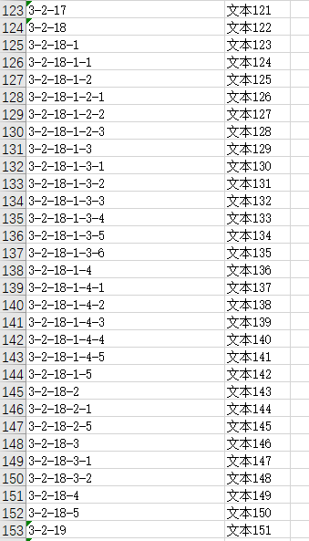
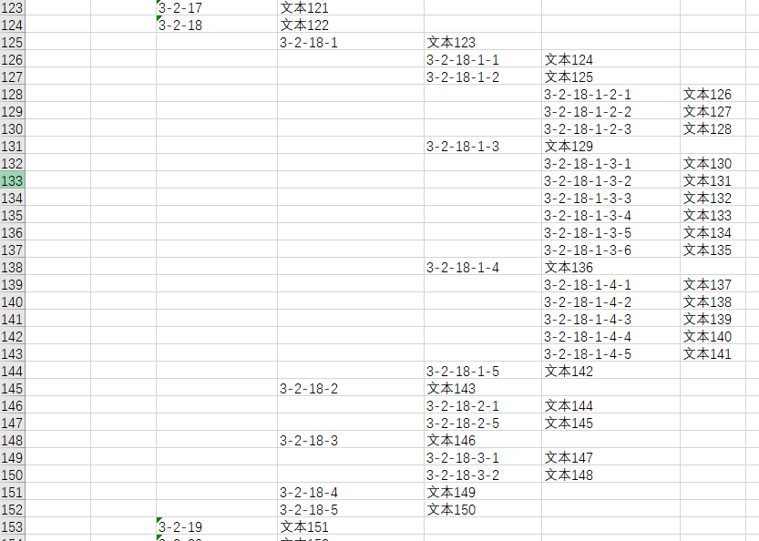
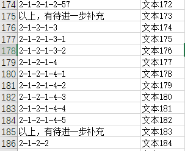
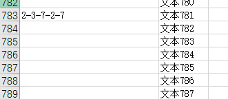

# excel处理程序 -- xlsx_format

功能：根据小标题对文档中的每一行进行缩进

## 处理效果

原本的数据格式：



处理后的数据格式：



## 处理过程

处理步骤：

1. 读excel文件：使用的openxyl包
2. 判断小标题的等级：根据“-”的数目来判断
3. 根据小标题的等级来进行缩进（另建新的sheet）


处理中要注意的地方：

1. 源文本中有一些注释性的文字，不移动。



```python
# 起始纯文字，则不移动
    if uni == 0:
        new_sheet[chr(ord('A') + uni) + str(n + 3)].value = content1
```

2. 源文本中有一些文本内容前没有小标题，需要就近跟随前一个标题移动。



```python
def count_and_indent(n, content):
    """根据‘-’的数量计数缩进量；对于没有编号的行（content[0]类型为None），向前寻找就近的缩进数（递归）"""
    global flag
    # print(n)
    if content[0] != None:
        numb = content[0].count("-")
        # 对于没有编号的只缩进内容,向前查找了flag行，缩进内容时要回到该行
        if flag != 0:
            # 获取第n+flag行的标题和文本内容
            content = get_content(n+flag)
        indent(numb, content[0], content[1])
    # 起始为空格，向前寻找就近的缩进数
    else:
        n -= 1
        flag += 1
        # 向前查找缩进量，调用自己
        count_and_indent(n, get_content(n))
    return
```

> 感觉这部分自己写得不是很好，搅了好一会儿，待改进


# 文件编码格式批量处理程序 -- coding_conversion
功能：批量将gbk编码的文件变为utf-8编码方式
代码直接来源于：https://www.jianshu.com/p/164f91f51dbc


> 若有误或待改进之处，望前辈们指正！